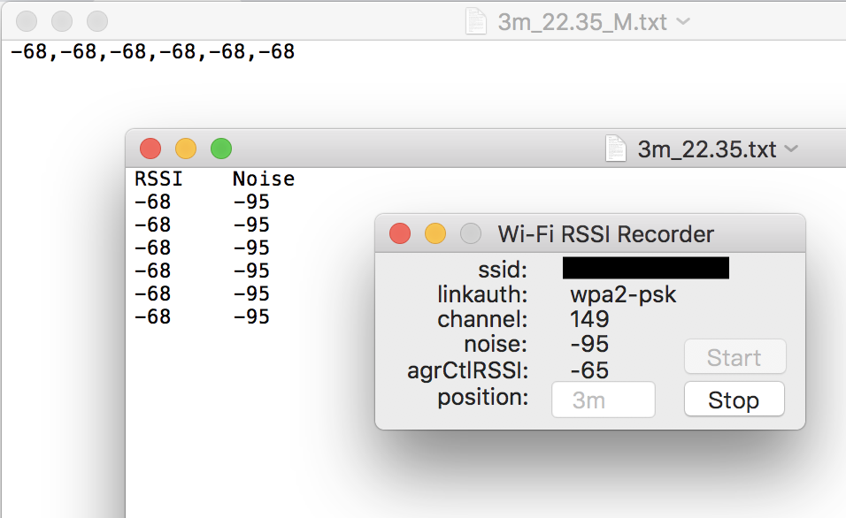

# WiFi-Info-Recorder
A WiFi information recorder for macOS. Written in Swift 2.1 (4.1 in the latest version).

Initially designed for my scientific usage.

You can use the program to record wifi RSSI and noise info to a txt file
which will be saved at "/Users/your_name/Desktop/", and named as "current_time.txt".

And you can also add the AP position info to the file name.

For example, you have a record which start at 2:37pm, and your Mac is 2.4 meters away from the AP,
so the export file name will be "2.4m_14.37.txt". And the program will export another txt file "2.4m_14.37_M.txt",
which contains only this WiFi AP's RSSIs info IN ONE LINE(separated by ',').

So you will know which format of txt file is better for you to use in your project.

## UPDATE AUG 14, 2018
Update the code to Swift 4.1 compatible.
Executable file is under Build/Products/Debug/WiFi-Info-Recorder.app, double click to run. Tested under macOS 10.13.6, Xcode 9.4.1.

## Preview

## IMPORTANT
Make sure you have connected to an AP **BEFORE** running the program
